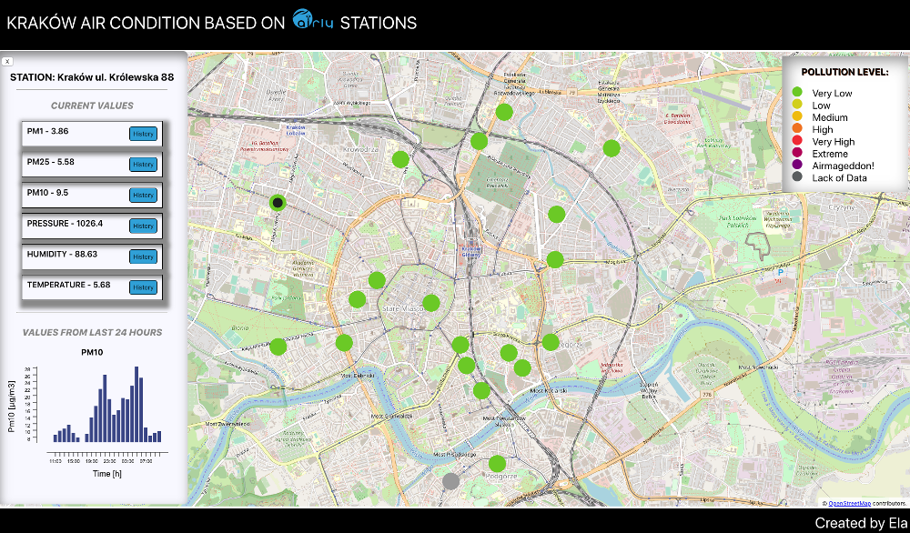

# README

### Description

KRAKÓW AIR CONDITION APP BASED ON [AIRLY](https://airly.eu/en/) API DATA

#### Technology and library using in this application:
* [React](https://reactjs.org)
* [Create React App](https://github.com/facebook/create-react-app)
* [Redux](https://redux.js.org)
* [Redux-Saga](https://redux-saga.js.org)
* [OpenLayers](https://openlayers.org)
* [VX](https://vx-demo.now.sh)

#### Working app is available [here](https://potik1.github.io/Krakow-air-condition)

Free API data (using in this App) is limited to 50 calls per min and 1000 calls per day, and after that you will see error 429